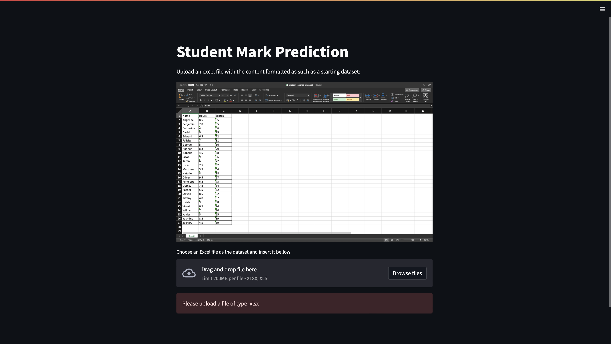

Made by: Cristoval Neo Sasono_2602158235

# Algorithm and Programming Final Project

## Table of contents

- [Introduction](#introduction)
- [Documentation](#documentation)
- [Running the Code](#running-the-code)

## Introduction

This project is made using the Python programming language. The main function/purpose of this project is to predict the next score of a student, or a class of students based on the number of hours they’ve put into studying. This function is achieved by implementing the Linear Regression statistical method.

## Documentation

This project has been documented in a report and a video demonstrating how the program functions:
1. PDF Report: https://drive.google.com/file/d/1_7UFhJEoElrKgPShPkLzOXlbPem_vSFb/view?usp=sharing
2. Video Demo: https://drive.google.com/file/d/1828a0k4V0NElDl4_AThc2fdJG9t-ykhA/view?usp=sharing

(Note that the video might be unplayable through the browser, so download the video to watch it.)

## Running the Code

To run the code, simply download all the files in this repository and type the following command into your terminal:

    streamlit run [Directory Path to app.py]

If everything runs smoothly, you should be met with this screen:

Follow the instructions and enjoy the program!
